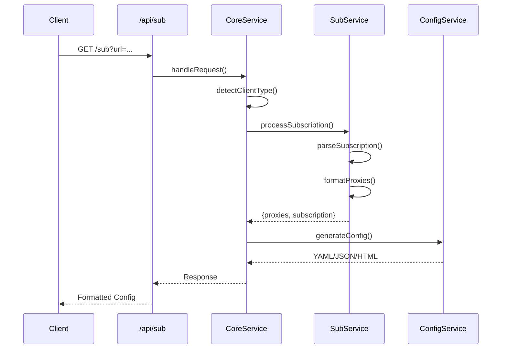

# Subscription Converter

<div align="center">

[](https://nextjs.org/)
[](https://www.typescriptlang.org/)
[](https://bun.sh/)
[](LICENSE)

**A modern, full-stack subscription conversion service with intelligent client detection and multi-format output support.**

[Live Demo](https://sub.xqd.pp.ua/) • [Documentation](./CLAUDE.md) • [Report Bug](https://github.com/xqd922/sub/issues) • [Request Feature](https://github.com/xqd922/sub/issues)

English | [简体中文](./README.zh-CN.md)

</div>

---

## Table of Contents

- [Overview](#overview)
- [Features](#features)
- [Architecture](#architecture)
- [Getting Started](#getting-started)
- [Usage](#usage)
- [API Reference](#api-reference)
- [Deployment](#deployment)
- [Contributing](#contributing)
- [License](#license)

---

## Overview

Subscription Converter is a high-performance proxy subscription conversion service built with Next.js 16, designed to seamlessly convert subscription links between different proxy client formats (Clash, Sing-box, etc.) with automatic client detection and intelligent formatting.

### Key Highlights

- **Next.js 16 with Turbopack** - Lightning-fast development and build performance
- **Intelligent Client Detection** - Automatically detects client type via User-Agent and returns appropriate format
- **Protocol Support** - Supports SS, VMess, Trojan, VLESS, Hysteria2, and SOCKS protocols
- **Edge Runtime** - Deployed on Cloudflare Pages for global edge distribution
- **Responsive Design** - Modern UI built with Tailwind CSS
- **Short URL Service** - Built-in URL shortener for easy sharing
- **Type Safety** - Full TypeScript implementation with comprehensive type definitions

---

## Features

### Core Functionality

#### Subscription Conversion
- Convert standard subscription URLs to Clash/Sing-box formats
- Parse single proxy node URIs (`ss://`, `vmess://`, `trojan://`, `vless://`, `hysteria2://`, `hy2://`, `socks://`)
- Fetch and aggregate nodes from GitHub Gist URLs
- Support for base64-encoded and YAML-formatted subscriptions

#### Client Detection
- **Automatic Format Detection** - Identifies Clash, Sing-box, or browser clients
- **User-Agent Based** - Detects client via standard User-Agent headers
- **Format-Specific Output** - Returns YAML for Clash, JSON for Sing-box, HTML preview for browsers

#### Node Processing
- **Name Formatting** - Automatic region-based node renaming with country/region flags
- **Multiplier Extraction** - Detects and preserves traffic multiplier information (e.g., `[0.5x]`)
- **Deduplication** - Removes duplicate nodes while preserving configuration
- **Chain Proxy Support** - Supports `chain:`, `dialer-proxy:`, and `detour:` for proxy chaining

### Technical Features

- **Edge Runtime** - All API routes use Edge Runtime for Cloudflare Pages compatibility
- **Smart User-Agent Strategy** - Rotates between real client User-Agents for better compatibility
- **Error Handling** - Comprehensive error tracking with structured logging
- **Performance Monitoring** - Built-in request statistics and processing time tracking

---

## Architecture

### Project Structure

```
subscription-converter/
├── app/                      # Next.js App Router
│   ├── api/                  # API Routes (Edge Runtime)
│   │   ├── shorten/          # Short URL service
│   │   └── sub/              # Subscription conversion endpoint
│   ├── components/           # React components
│   ├── page.tsx              # Homepage
│   └── layout.tsx            # Root layout
├── features/                 # Business logic modules
│   ├── convert/              # Subscription conversion
│   │   ├── handler.ts        # Request handler (CoreService)
│   │   ├── processor.ts      # Subscription processor (SubService)
│   │   └── builder.ts        # Config builder (ConfigService)
│   ├── shorten/              # URL shortening
│   │   └── shortener.ts      # Short URL service
│   └── metrics/              # Network & monitoring
│       └── network.ts        # Network request service
├── lib/                      # Utility libraries
│   ├── core/                 # Core infrastructure
│   │   ├── types.ts          # Type definitions
│   │   ├── utils.ts          # Utility functions
│   │   └── logger.ts         # Logging system
│   ├── parse/                # Parsers
│   │   ├── node.ts           # Node parser
│   │   ├── subscription.ts   # Subscription parser
│   │   ├── remote.ts         # Remote node fetcher
│   │   └── protocols/        # Protocol parsers
│   │       ├── shadowsocks.ts
│   │       ├── vmess.ts
│   │       ├── trojan.ts
│   │       ├── vless.ts
│   │       ├── hysteria2.ts
│   │       └── socks.ts
│   ├── format/               # Formatters
│   │   ├── node.ts           # Node formatting
│   │   └── region.ts         # Region mapping
│   └── error/                # Error handling
│       ├── errors.ts         # Error definitions
│       └── reporter.ts       # Error reporting
├── config/                   # Configuration generators
│   ├── clash.ts              # Clash config generator
│   └── singbox.ts            # Sing-box config generator
└── styles/                   # Styling
    └── preview.css           # Preview page styles
```

### Request Flow



### Supported Protocols

| Protocol | URI Scheme | Parser | Status |
|----------|-----------|--------|--------|
| Shadowsocks | `ss://` | `shadowsocks.ts` | ✅ Supported |
| VMess | `vmess://` | `vmess.ts` | ✅ Supported |
| Trojan | `trojan://` | `trojan.ts` | ✅ Supported |
| VLESS | `vless://` | `vless.ts` | ✅ Supported |
| Hysteria2 | `hysteria2://`, `hy2://` | `hysteria2.ts` | ✅ Supported |
| SOCKS | `socks://` | `socks.ts` | ✅ Supported |

---

## Getting Started

### Prerequisites

- **Node.js** >= 18.0.0
- **Bun** >= 1.0.0 (recommended) or npm/pnpm/yarn

### Installation

```bash
# Clone the repository
git clone https://github.com/xqd922/sub.git
cd sub

# Install dependencies
bun install

# Start development server
bun dev

# Or use fast mode (skip linting and type checking)
bun dev:fast
```

The application will be available at `http://localhost:3000`.

### Available Scripts

```bash
# Development
bun dev                 # Start development server with Turbopack
bun dev:fast           # Fast mode (skip lint & type check)

# Production
bun run build          # Build for production
bun start              # Start production server

# Code Quality
bun run lint           # Run ESLint

# Deployment
bun run pages:build    # Build for Cloudflare Pages
bun run pages:deploy   # Build & deploy to Cloudflare Pages
```

---

## Usage

### Web Interface

1. Navigate to the homepage
2. Enter your subscription URL or proxy node URI
3. Click "Convert" button
4. The converted subscription URL is automatically copied to clipboard
5. Optionally generate a short URL for easier sharing

### API Integration

#### Basic Conversion

```bash
# For Clash clients (returns YAML)
curl -H "User-Agent: clash.meta/v1.19.13" \
  "https://sub.xqd.pp.ua/sub?url=YOUR_SUBSCRIPTION_URL"

# For Sing-box clients (returns JSON)
curl -H "User-Agent: sing-box/1.0.0" \
  "https://sub.xqd.pp.ua/sub?url=YOUR_SUBSCRIPTION_URL"

# For browser access (returns HTML preview)
curl "https://sub.xqd.pp.ua/sub?url=YOUR_SUBSCRIPTION_URL"
```

#### Input Formats

```bash
# Standard subscription URL
https://sub.xqd.pp.ua/sub?url=https://example.com/subscription

# Single proxy node
https://sub.xqd.pp.ua/sub?url=ss://base64encodedstring#node-name

# GitHub Gist
https://sub.xqd.pp.ua/sub?url=https://gist.githubusercontent.com/user/id/raw/file

# Multiple nodes (space or newline separated in Gist)
ss://node1
vmess://node2
trojan://node3
```

#### Chain Proxy Configuration

Supports proxy chaining via special syntax:

```bash
# Using chain: marker (works for both Clash and Sing-box)
socks://auth@server:port#node-name|chain:parent-node-name

# Using dialer-proxy: marker (Clash specific)
ss://config#node-name|dialer-proxy:parent-node-name

# Using detour: marker (Sing-box specific)
vmess://config#node-name|detour:parent-node-name
```

---

## API Reference

### `GET /api/sub`

Convert subscription or proxy node URI to client-specific format.

#### Query Parameters

| Parameter | Type | Required | Description |
|-----------|------|----------|-------------|
| `url` | string | Yes | Subscription URL or proxy node URI |

#### Request Headers

| Header | Description | Example |
|--------|-------------|---------|
| `User-Agent` | Client identifier for format detection | `clash.meta/v1.19.13` |

#### Response Headers

| Header | Description |
|--------|-------------|
| `Content-Type` | YAML, JSON, or HTML based on client |
| `Content-Disposition` | Filename for download |
| `subscription-userinfo` | Traffic usage information |
| `profile-update-interval` | Update interval in hours |
| `profile-web-page-url` | Provider homepage URL |

#### Response Formats

**Clash (YAML)**
```yaml
proxies:
  - name: "🇭🇰 HK 01"
    type: ss
    server: example.com
    port: 8388
    cipher: aes-256-gcm
    password: password

proxy-groups:
  - name: Manual
    type: select
    proxies:
      - Auto
      - DIRECT
      - 🇭🇰 HK 01

rules:
  - DOMAIN-SUFFIX,google.com,Manual
  - GEOIP,CN,DIRECT
  - MATCH,Manual
```

**Sing-box (JSON)**
```json
{
  "outbounds": [
    {
      "type": "shadowsocks",
      "tag": "🇭🇰 HK 01",
      "server": "example.com",
      "server_port": 8388,
      "method": "aes-256-gcm",
      "password": "password"
    }
  ],
  "route": {
    "rules": [
      {
        "domain_suffix": ["google.com"],
        "outbound": "Manual"
      }
    ]
  }
}
```

### `POST /api/shorten`

Generate a shortened URL for a subscription link.

#### Request Body

```json
{
  "url": "https://sub.xqd.pp.ua/sub?url=..."
}
```

#### Response

```json
{
  "shortUrl": "https://sub.xqd.pp.ua/s/abc123",
  "originalUrl": "https://sub.xqd.pp.ua/sub?url=..."
}
```

---

## Deployment

### Cloudflare Pages (Recommended)

This project is optimized for Cloudflare Pages deployment with Edge Runtime.

#### Automatic Deployment

1. Fork this repository
2. Connect your GitHub account to Cloudflare Pages
3. Select the repository and configure:
   - **Framework preset**: Next.js
   - **Build command**: `bun run build && bun run pages:build`
   - **Build output directory**: `.vercel/output/static`
   - **Environment variables**:
     - `NODE_VERSION=18`
     - `BUN_VERSION=latest`

#### Manual Deployment

```bash
# Build for Cloudflare Pages
bun run build
bun run pages:build

# Deploy using Wrangler (optional)
bunx wrangler pages deploy .vercel/output/static
```

### Vercel

```bash
# Deploy to Vercel
vercel --prod

# Or use Vercel CLI with configuration
bun run build
vercel deploy --prod
```

### Docker

```dockerfile
FROM oven/bun:1 AS base
WORKDIR /app

# Install dependencies
COPY package.json bun.lock ./
RUN bun install --frozen-lockfile

# Copy source
COPY . .

# Build
RUN bun run build

# Expose port
EXPOSE 3000

# Start server
CMD ["bun", "start"]
```

```bash
# Build and run
docker build -t subscription-converter .
docker run -p 3000:3000 subscription-converter
```

### Environment Variables

```bash
# Optional: Short URL service integration
BITLY_TOKEN=your_bitly_api_token
SINK_URL=https://your-sink-instance.com
SINK_TOKEN=your_sink_auth_token

# Environment
NODE_ENV=production
```

---

## Contributing

Contributions are welcome! Please follow these guidelines:

### Development Workflow

1. **Fork** the repository
2. **Create** a feature branch: `git checkout -b feature/amazing-feature`
3. **Commit** your changes: `git commit -m 'feat: add amazing feature'`
4. **Push** to the branch: `git push origin feature/amazing-feature`
5. **Open** a Pull Request

### Commit Convention

This project follows [Conventional Commits](https://www.conventionalcommits.org/):

- `feat:` - New features
- `fix:` - Bug fixes
- `docs:` - Documentation updates
- `style:` - Code style changes (formatting, etc.)
- `refactor:` - Code refactoring
- `perf:` - Performance improvements
- `test:` - Adding or updating tests
- `chore:` - Build process or tooling changes

### Code Style

- **TypeScript**: Strict mode enabled
- **ESLint**: Run `bun run lint` before committing
- **Formatting**: Follow existing code style

### Testing

```bash
# Run type checking
bun run build

# Run linter
bun run lint
```

---

## License

This project is licensed under the **MIT License** - see the [LICENSE](LICENSE) file for details.

---

## Acknowledgments

- [Next.js](https://nextjs.org/) - The React Framework for Production
- [Cloudflare Pages](https://pages.cloudflare.com/) - Global edge network
- [Bun](https://bun.sh/) - Fast JavaScript runtime and toolkit
- [Tailwind CSS](https://tailwindcss.com/) - Utility-first CSS framework
- [js-yaml](https://github.com/nodeca/js-yaml) - YAML parser for JavaScript

---

## Support

- **Documentation**: [CLAUDE.md](./CLAUDE.md)
- **Issues**: [GitHub Issues](https://github.com/xqd922/sub/issues)
- **Discussions**: [GitHub Discussions](https://github.com/xqd922/sub/discussions)

---

<div align="center">

**If you find this project helpful, please consider giving it a Star!**

Made by [xqd922](https://github.com/xqd922)

[⬆ Back to Top](#subscription-converter)

</div>
