# 🚀 通用订阅转换 Universal Subscription Converter

<div align="center">


**一个现代化的全栈订阅转换服务，支持智能客户端检测和多格式输出**

[🌟 在线体验](https://sub.xqd.pp.ua/) • [📖 文档](./docs/API.md) • [🛠️ 部署](#部署) • [🤝 贡献](#贡献)

</div>

## ✨ 特性

### 🎯 核心功能
- **🔄 智能转换**: 自动将订阅链接转换为 Clash、Sing-box 等客户端配置
- **🤖 智能检测**: 根据 User-Agent 自动识别客户端类型并返回对应格式
- **🌐 多源支持**: 支持标准订阅、单节点链接、GitHub Gist 等多种输入格式
- **🔗 短链接**: 内置短链接生成服务，方便分享
- **📱 响应式**: 完美适配桌面端和移动端

### 🚀 技术亮点
- **⚡ Turbopack**: 启用 Next.js 最新打包器，极速开发体验
- **🎨 现代UI**: 基于 Tailwind CSS 的精美界面，支持深色模式
- **🛡️ 类型安全**: 完整的 TypeScript 类型定义
- **📊 性能监控**: 内置请求统计和性能分析
- **🔧 模块化**: 清晰的功能模块划分，易于维护和扩展

### 🌍 支持的协议
- **Shadowsocks** (`ss://`)
- **VMess** (`vmess://`)
- **Trojan** (`trojan://`)
- **VLESS** (`vless://`)
- **Hysteria2** (`hysteria2://`, `hy2://`)

## 🏗️ 架构设计

### 📁 项目结构
```
project/
├── app/            # Next.js App Router (路由和页面)
│   ├── api/        # API 路由
│   ├── components/ # React 组件
│   └── hooks/      # 自定义 Hooks
├── lib/            # 工具库
│   ├── core/       # 核心工具 (types, cache, logger)
│   ├── parse/      # 解析器 (订阅、节点、协议)
│   ├── format/     # 格式化器 (节点名称、地区)
│   └── error/      # 错误处理
├── features/       # 功能模块 (业务逻辑)
│   ├── convert/    # 订阅转换
│   ├── shorten/    # 短链接
│   └── metrics/    # 指标收集
├── config/         # 配置生成器
└── public/         # 静态资源
```

### 🔄 请求处理流程

```mermaid
graph LR
    A[客户端请求] --> B[智能检测]
    B --> C[订阅解析]
    C --> D[节点处理]
    D --> E[配置生成]
    E --> F[格式化输出]
    F --> G[返回结果]
```


## 🚀 快速开始

### 📋 环境要求
- **Node.js** >= 18.0.0
- **Bun** >= 1.0.0 (推荐) 或 npm/yarn

### ⚡ 本地开发

```bash
# 克隆项目
git clone https://github.com/xqd922/sub.git
cd sub

# 安装依赖
bun install

# 启动开发服务器
bun dev
# 或使用极速模式 (跳过类型检查)
bun dev:fast

# 访问 http://localhost:3000
```

### 🛠️ 可用命令

```bash
# 开发
bun dev                 # 标准开发模式 (启用 Turbopack)
bun dev:fast           # 极速模式 (跳过 lint 和类型检查)

# 构建
bun run build          # 构建生产版本
bun start              # 启动生产服务器

# 代码质量
bun run lint           # ESLint 检查
```

## 💻 使用方法

### 🌐 Web 界面
1. 访问应用主页
2. 输入订阅链接或节点链接
3. 点击「转换」按钮
4. 自动复制转换后的链接
5. 可选择生成短链接便于分享

### 🔗 API 调用

#### 基本转换
```bash
# Clash 客户端
curl -H "User-Agent: clash.meta/v1.19.13" \
  "https://sub.xqd.pp.ua/sub?url=https://your-subscription-url"

# Sing-box 客户端
curl -H "User-Agent: sing-box/1.0.0" \
  "https://sub.xqd.pp.ua/sub?url=https://your-subscription-url"

# 浏览器访问 (返回 HTML 预览)
curl "https://sub.xqd.pp.ua/sub?url=https://your-subscription-url"
```

#### 支持的输入格式
```bash
# 标准订阅链接
?url=https://example.com/subscription

# 单节点链接
?url=ss://base64encodedstring

# GitHub Gist
?url=https://gist.githubusercontent.com/user/id/raw/file
```

### 📱 客户端配置

#### Clash
```yaml
# 使用转换后的链接更新 Clash 订阅
proxies: []
proxy-groups: []
rules: []
```

#### Sing-box
```json
{
  "outbounds": [],
  "route": {
    "rules": []
  }
}
```

## 🔧 配置说明

### 🌍 环境变量
```bash
# 短链接服务 (可选)
BITLY_TOKEN=your_bitly_api_token
SINK_URL=https://your-sink-instance.com
SINK_TOKEN=your_sink_auth_token

# 环境配置
NODE_ENV=production
```

### ⚙️ 高级配置

#### Next.js 配置 (`next.config.ts`)
```typescript
const nextConfig = {
  experimental: {
    turbo: {},  // 启用 Turbopack
  },
  reactStrictMode: false,  // 优化开发体验
  // ...其他配置
}
```

#### TypeScript 配置 (`tsconfig.json`)
```json
{
  "compilerOptions": {
    "target": "ES2022",
    "paths": {
      "@/*": ["./*"]  // 路径别名
    }
  }
}
```

## 🚀 部署

### 🌐 Vercel (推荐)
```bash
# 一键部署到 Vercel
vercel --prod

# 或使用 Vercel CLI
npx vercel
```

### 🐳 Docker
```dockerfile
FROM node:18-alpine
WORKDIR /app
COPY package*.json ./
RUN npm ci --only=production
COPY . .
RUN npm run build
EXPOSE 3000
CMD ["npm", "start"]
```

### 📋 部署检查清单
- ✅ 设置正确的环境变量
- ✅ 确保使用 Node.js 运行时 (API 路由)
- ✅ 配置域名和 SSL 证书
- ✅ 设置缓存策略

## 🤝 贡献

### 🔧 开发指南
1. Fork 本仓库
2. 创建功能分支: `git checkout -b feature/amazing-feature`
3. 提交更改: `git commit -m 'feat: add amazing feature'`
4. 推送分支: `git push origin feature/amazing-feature`
5. 提交 Pull Request

### 📝 提交规范
使用 [Conventional Commits](https://conventionalcommits.org/) 规范:
- `feat:` 新功能
- `fix:` 修复问题
- `docs:` 文档更新
- `style:` 代码格式调整
- `refactor:` 代码重构
- `test:` 添加测试
- `chore:` 工具配置等

### 🐛 问题报告
发现问题？请 [提交 Issue](https://github.com/xqd922/sub/issues) 并提供:
- 详细的问题描述
- 复现步骤
- 期望行为
- 环境信息

## 📄 许可证

本项目采用 [MIT 许可证](LICENSE)。

## 🙏 致谢

- [Next.js](https://nextjs.org/) - React 全栈框架
- [Tailwind CSS](https://tailwindcss.com/) - CSS 框架
- [Bun](https://bun.sh/) - 快速的 JavaScript 运行时
- [js-yaml](https://github.com/nodeca/js-yaml) - YAML 解析库

---

<div align="center">

**如果这个项目对你有帮助，请给个 ⭐ Star 支持一下！**

Made with ❤️ by [xqd922](https://github.com/xqd922)

</div>