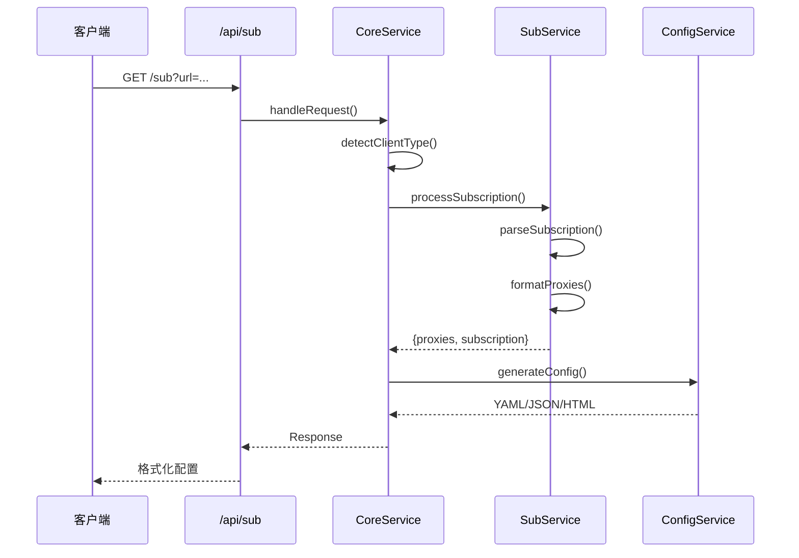

# 订阅转换器

<div align="center">

[](https://nextjs.org/)
[](https://www.typescriptlang.org/)
[](https://bun.sh/)
[](LICENSE)

**一个现代化的全栈代理订阅转换服务，支持智能客户端检测和多格式输出。**

[在线演示](https://sub.xqd.pp.ua/) • [技术文档](./CLAUDE.md) • [报告问题](https://github.com/xqd922/sub/issues) • [功能建议](https://github.com/xqd922/sub/issues)

[English](./README.md) | 简体中文

</div>

---

## 目录

- [项目简介](#项目简介)
- [功能特性](#功能特性)
- [系统架构](#系统架构)
- [快速开始](#快速开始)
- [使用方法](#使用方法)
- [API 文档](#api-文档)
- [部署指南](#部署指南)
- [贡献指南](#贡献指南)
- [开源许可](#开源许可)

---

## 项目简介

订阅转换器是一个基于 Next.js 16 构建的高性能代理订阅转换服务，旨在无缝转换不同代理客户端格式（Clash、Sing-box 等）的订阅链接，具有自动客户端检测和智能格式化功能。

### 核心亮点

- **Next.js 16 + Turbopack** - 极速的开发和构建性能
- **智能客户端检测** - 自动识别客户端类型并返回对应格式
- **协议全支持** - 支持 SS、VMess、Trojan、VLESS、Hysteria2 和 SOCKS 协议
- **边缘运行时** - 部署在 Cloudflare Pages，全球边缘节点分发
- **响应式设计** - 基于 Tailwind CSS 构建的现代化 UI
- **短链接服务** - 内置短链接生成器，便于分享
- **类型安全** - 完整的 TypeScript 类型定义

---

## 功能特性

### 核心功能

#### 订阅转换
- 将标准订阅 URL 转换为 Clash/Sing-box 格式
- 解析单节点代理 URI（`ss://`、`vmess://`、`trojan://`、`vless://`、`hysteria2://`、`hy2://`、`socks://`）
- 从 GitHub Gist URL 获取并聚合节点
- 支持 base64 编码和 YAML 格式的订阅

#### 客户端检测
- **自动格式检测** - 识别 Clash、Sing-box 或浏览器客户端
- **基于 User-Agent** - 通过标准 User-Agent 请求头检测客户端
- **格式化输出** - Clash 返回 YAML，Sing-box 返回 JSON，浏览器返回 HTML 预览

#### 节点处理
- **名称格式化** - 基于地区自动重命名节点并添加国家/地区旗帜
- **倍率提取** - 检测并保留流量倍率信息（如 `[0.5x]`）
- **去重处理** - 移除重复节点，同时保留配置
- **链式代理** - 支持 `chain:`、`dialer-proxy:` 和 `detour:` 链式代理

### 技术特性

- **边缘运行时** - 所有 API 路由使用 Edge Runtime，兼容 Cloudflare Pages
- **智能 User-Agent 策略** - 在真实客户端 User-Agent 之间轮换，提高兼容性
- **错误处理** - 完善的错误追踪和结构化日志
- **性能监控** - 内置请求统计和处理时间追踪

---

## 系统架构

### 项目结构

```
subscription-converter/
├── app/                      # Next.js App Router
│   ├── api/                  # API 路由（Edge Runtime）
│   │   ├── shorten/          # 短链接服务
│   │   └── sub/              # 订阅转换端点
│   ├── components/           # React 组件
│   ├── page.tsx              # 首页
│   └── layout.tsx            # 根布局
├── features/                 # 业务逻辑模块
│   ├── convert/              # 订阅转换
│   │   ├── handler.ts        # 请求处理器（CoreService）
│   │   ├── processor.ts      # 订阅处理器（SubService）
│   │   └── builder.ts        # 配置构建器（ConfigService）
│   ├── shorten/              # URL 缩短
│   │   └── shortener.ts      # 短链接服务
│   └── metrics/              # 网络与监控
│       └── network.ts        # 网络请求服务
├── lib/                      # 工具库
│   ├── core/                 # 核心基础设施
│   │   ├── types.ts          # 类型定义
│   │   ├── utils.ts          # 工具函数
│   │   └── logger.ts         # 日志系统
│   ├── parse/                # 解析器
│   │   ├── node.ts           # 节点解析器
│   │   ├── subscription.ts   # 订阅解析器
│   │   ├── remote.ts         # 远程节点获取器
│   │   └── protocols/        # 协议解析器
│   │       ├── shadowsocks.ts
│   │       ├── vmess.ts
│   │       ├── trojan.ts
│   │       ├── vless.ts
│   │       ├── hysteria2.ts
│   │       └── socks.ts
│   ├── format/               # 格式化器
│   │   ├── node.ts           # 节点格式化
│   │   └── region.ts         # 地区映射
│   └── error/                # 错误处理
│       ├── errors.ts         # 错误定义
│       └── reporter.ts       # 错误报告
├── config/                   # 配置生成器
│   ├── clash.ts              # Clash 配置生成器
│   └── singbox.ts            # Sing-box 配置生成器
└── styles/                   # 样式
    └── preview.css           # 预览页面样式
```

### 请求流程



### 支持的协议

| 协议 | URI 格式 | 解析器 | 状态 |
|------|---------|--------|------|
| Shadowsocks | `ss://` | `shadowsocks.ts` | ✅ 已支持 |
| VMess | `vmess://` | `vmess.ts` | ✅ 已支持 |
| Trojan | `trojan://` | `trojan.ts` | ✅ 已支持 |
| VLESS | `vless://` | `vless.ts` | ✅ 已支持 |
| Hysteria2 | `hysteria2://`, `hy2://` | `hysteria2.ts` | ✅ 已支持 |
| SOCKS | `socks://` | `socks.ts` | ✅ 已支持 |

---

## 快速开始

### 环境要求

- **Node.js** >= 18.0.0
- **Bun** >= 1.0.0（推荐）或 npm/pnpm/yarn

### 安装步骤

```bash
# 克隆仓库
git clone https://github.com/xqd922/sub.git
cd sub

# 安装依赖
bun install

# 启动开发服务器
bun dev

# 或使用快速模式（跳过 lint 和类型检查）
bun dev:fast
```

应用将在 `http://localhost:3000` 运行。

### 可用命令

```bash
# 开发
bun dev                 # 启动 Turbopack 开发服务器
bun dev:fast           # 快速模式（跳过 lint 和类型检查）

# 生产
bun run build          # 构建生产版本
bun start              # 启动生产服务器

# 代码质量
bun run lint           # 运行 ESLint

# 部署
bun run pages:build    # 构建 Cloudflare Pages 版本
bun run pages:deploy   # 构建并部署到 Cloudflare Pages
```

---

## 使用方法

### Web 界面

1. 访问应用首页
2. 输入订阅 URL 或代理节点 URI
3. 点击"转换"按钮
4. 转换后的订阅 URL 将自动复制到剪贴板
5. 可选择生成短链接以便分享

### API 集成

#### 基础转换

```bash
# Clash 客户端（返回 YAML）
curl -H "User-Agent: clash.meta/v1.19.13" \
  "https://sub.xqd.pp.ua/sub?url=你的订阅URL"

# Sing-box 客户端（返回 JSON）
curl -H "User-Agent: sing-box/1.0.0" \
  "https://sub.xqd.pp.ua/sub?url=你的订阅URL"

# 浏览器访问（返回 HTML 预览）
curl "https://sub.xqd.pp.ua/sub?url=你的订阅URL"
```

#### 输入格式

```bash
# 标准订阅 URL
https://sub.xqd.pp.ua/sub?url=https://example.com/subscription

# 单个代理节点
https://sub.xqd.pp.ua/sub?url=ss://base64编码字符串#节点名称

# GitHub Gist
https://sub.xqd.pp.ua/sub?url=https://gist.githubusercontent.com/user/id/raw/file

# 多个节点（在 Gist 中用空格或换行分隔）
ss://节点1
vmess://节点2
trojan://节点3
```

#### 链式代理配置

支持通过特殊语法配置链式代理：

```bash
# 使用 chain: 标记（Clash 和 Sing-box 通用）
socks://认证@服务器:端口#节点名称|chain:父节点名称

# 使用 dialer-proxy: 标记（Clash 专用）
ss://配置#节点名称|dialer-proxy:父节点名称

# 使用 detour: 标记（Sing-box 专用）
vmess://配置#节点名称|detour:父节点名称
```

---

## API 文档

### `GET /api/sub`

将订阅或代理节点 URI 转换为客户端特定格式。

#### 查询参数

| 参数 | 类型 | 必需 | 说明 |
|------|------|------|------|
| `url` | string | 是 | 订阅 URL 或代理节点 URI |

#### 请求头

| 请求头 | 说明 | 示例 |
|--------|------|------|
| `User-Agent` | 客户端标识，用于格式检测 | `clash.meta/v1.19.13` |

#### 响应头

| 响应头 | 说明 |
|--------|------|
| `Content-Type` | 根据客户端返回 YAML、JSON 或 HTML |
| `Content-Disposition` | 下载文件名 |
| `subscription-userinfo` | 流量使用信息 |
| `profile-update-interval` | 更新间隔（小时） |
| `profile-web-page-url` | 提供商主页 URL |

#### 响应格式

**Clash（YAML）**
```yaml
proxies:
  - name: "🇭🇰 HK 01"
    type: ss
    server: example.com
    port: 8388
    cipher: aes-256-gcm
    password: password

proxy-groups:
  - name: Manual
    type: select
    proxies:
      - Auto
      - DIRECT
      - 🇭🇰 HK 01

rules:
  - DOMAIN-SUFFIX,google.com,Manual
  - GEOIP,CN,DIRECT
  - MATCH,Manual
```

**Sing-box（JSON）**
```json
{
  "outbounds": [
    {
      "type": "shadowsocks",
      "tag": "🇭🇰 HK 01",
      "server": "example.com",
      "server_port": 8388,
      "method": "aes-256-gcm",
      "password": "password"
    }
  ],
  "route": {
    "rules": [
      {
        "domain_suffix": ["google.com"],
        "outbound": "Manual"
      }
    ]
  }
}
```

### `POST /api/shorten`

为订阅链接生成短链接。

#### 请求体

```json
{
  "url": "https://sub.xqd.pp.ua/sub?url=..."
}
```

#### 响应

```json
{
  "shortUrl": "https://sub.xqd.pp.ua/s/abc123",
  "originalUrl": "https://sub.xqd.pp.ua/sub?url=..."
}
```

---

## 部署指南

### Cloudflare Pages（推荐）

本项目针对 Cloudflare Pages 的 Edge Runtime 进行了优化。

#### 自动部署

1. Fork 本仓库
2. 将 GitHub 账户连接到 Cloudflare Pages
3. 选择仓库并配置：
   - **框架预设**：Next.js
   - **构建命令**：`bun run build && bun run pages:build`
   - **构建输出目录**：`.vercel/output/static`
   - **环境变量**：
     - `NODE_VERSION=18`
     - `BUN_VERSION=latest`

#### 手动部署

```bash
# 构建 Cloudflare Pages 版本
bun run build
bun run pages:build

# 使用 Wrangler 部署（可选）
bunx wrangler pages deploy .vercel/output/static
```

### Vercel

```bash
# 部署到 Vercel
vercel --prod

# 或使用 Vercel CLI 配置部署
bun run build
vercel deploy --prod
```

### Docker

```dockerfile
FROM oven/bun:1 AS base
WORKDIR /app

# 安装依赖
COPY package.json bun.lock ./
RUN bun install --frozen-lockfile

# 复制源代码
COPY . .

# 构建
RUN bun run build

# 暴露端口
EXPOSE 3000

# 启动服务器
CMD ["bun", "start"]
```

```bash
# 构建并运行
docker build -t subscription-converter .
docker run -p 3000:3000 subscription-converter
```

### 环境变量

```bash
# 可选：短链接服务集成
BITLY_TOKEN=你的_bitly_api_token
SINK_URL=https://你的-sink-实例.com
SINK_TOKEN=你的_sink_认证_token

# 环境配置
NODE_ENV=production
```

---

## 贡献指南

欢迎贡献！请遵循以下指南：

### 开发流程

1. **Fork** 本仓库
2. **创建**功能分支：`git checkout -b feature/amazing-feature`
3. **提交**更改：`git commit -m 'feat: add amazing feature'`
4. **推送**分支：`git push origin feature/amazing-feature`
5. **提交** Pull Request

### 提交规范

本项目遵循 [Conventional Commits](https://www.conventionalcommits.org/zh-hans/) 规范：

- `feat:` - 新功能
- `fix:` - 问题修复
- `docs:` - 文档更新
- `style:` - 代码样式更改（格式化等）
- `refactor:` - 代码重构
- `perf:` - 性能改进
- `test:` - 添加或更新测试
- `chore:` - 构建过程或工具更改

### 代码风格

- **TypeScript**：启用严格模式
- **ESLint**：提交前运行 `bun run lint`
- **格式化**：遵循现有代码风格

### 测试

```bash
# 运行类型检查
bun run build

# 运行 Linter
bun run lint
```

---

## 开源许可

本项目采用 **MIT 许可证** - 详见 [LICENSE](LICENSE) 文件。

---

## 致谢

- [Next.js](https://nextjs.org/) - 生产级 React 框架
- [Cloudflare Pages](https://pages.cloudflare.com/) - 全球边缘网络
- [Bun](https://bun.sh/) - 快速的 JavaScript 运行时和工具包
- [Tailwind CSS](https://tailwindcss.com/) - 实用优先的 CSS 框架
- [js-yaml](https://github.com/nodeca/js-yaml) - JavaScript YAML 解析器

---

## 支持

- **技术文档**：[CLAUDE.md](./CLAUDE.md)
- **问题反馈**：[GitHub Issues](https://github.com/xqd922/sub/issues)
- **讨论交流**：[GitHub Discussions](https://github.com/xqd922/sub/discussions)

---

<div align="center">

**如果这个项目对你有帮助，请给个 Star 支持一下！**

Made by [xqd922](https://github.com/xqd922)

[⬆ 回到顶部](#订阅转换器)

</div>
